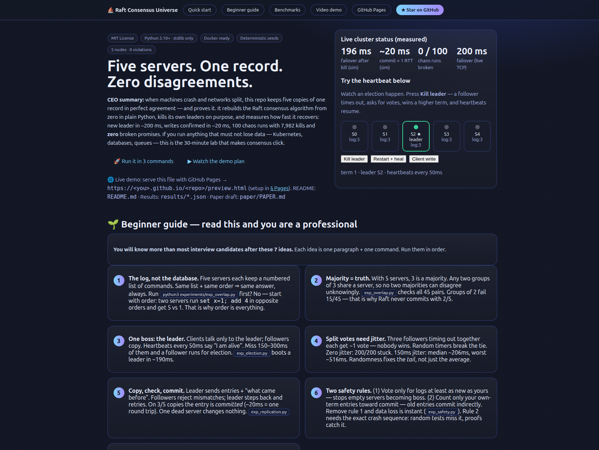
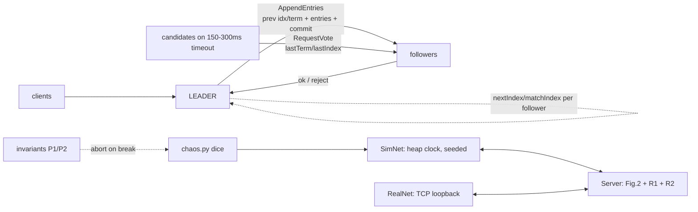
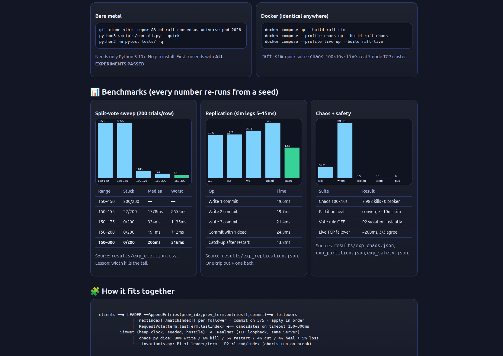

# ⛵ Raft Consensus Universe — five servers, one record, zero disagreements


🌐 **Live demo:** https://M0-AR.github.io/raft-consensus-universe-phd-2026/preview.html — if that 404s, use https://M0-AR.github.io/raft-consensus-universe-phd-2026/docs/preview.html (same page; the two URLs cover the two Pages source settings — see [§ GitHub Pages](#-github-pages--read-this-repo-as-a-website) + `docs/PAGES.md`).

> **CEO summary (30 seconds).** Anything that must not lose data — Kubernetes, databases, queues — keeps several copies of one record. This repo shows how five copies stay in perfect agreement while machines crash and networks split. It rebuilds the Raft consensus algorithm from zero in plain Python with no libraries, kills its own leaders on purpose, and measures the recovery: a new leader in ~200 ms, writes confirmed in ~20 ms, and 100 chaos runs with 7,982 kills and **zero** broken promises. Students learn consensus in an afternoon; engineers rehearse failure drills; researchers get seven measured findings with seeds to extend. Run three commands and every number below reappears on your machine.



**What this is:** a complete, verified Raft lab — deterministic simulation + live TCP cluster + chaos-monkey benchmarks — in ~1,500 lines of dependency-free Python. Based on Ongaro & Ousterhout *In Search of an Understandable Consensus Algorithm* (Stanford, 2014).

**Quick links:** [🌱 Beginner guide](#-beginner-guide--read-this-and-you-are-a-professional) · [🚀 Quick start](#-quick-start-3-commands-60-seconds) · [▶ Video demo](#-video-demo-60-seconds) · [📊 Benchmarks](#-benchmarks-every-number-re-runs-from-a-seed) · [🧩 Architecture](#-how-it-fits-together) · [👥 User stories](#-who-is-this-for) · [🌐 Pages](#-github-pages--read-this-repo-as-a-website) · [❓ FAQ](#-faq--troubleshooting)

---

## Table of contents

- [🌱 Beginner guide — read this and you are a professional](#-beginner-guide--read-this-and-you-are-a-professional)
- [✨ Features](#-features)
- [👥 Who is this for](#-who-is-this-for)
- [🚀 Quick start](#-quick-start-3-commands-60-seconds)
- [📖 Usage — the 7 experiments](#-usage--the-7-experiments)
- [🧩 How it fits together](#-how-it-fits-together)
- [📊 Benchmarks](#-benchmarks-every-number-re-runs-from-a-seed)
- [▶ Video demo](#-video-demo-60-seconds)
- [🖼️ Screenshots](#️-screenshots)
- [🌐 GitHub Pages — read this repo as a website](#-github-pages--read-this-repo-as-a-website)
- [⚙️ Configuration](#️-configuration)
- [❓ FAQ + troubleshooting](#-faq--troubleshooting)
- [🗺️ Roadmap](#️-roadmap)
- [🤝 Contributing](#-contributing)
- [📜 License](#-license)
- [🙏 Acknowledgments + citation](#-acknowledgments--citation)

---

## 🌱 Beginner guide — read this and you are a professional

> You will know more than most interview candidates after these 7 ideas. Each idea is one paragraph + one command. Run them in order. No distributed-systems background needed.

### 1. The log, not the database — order is everything

Five servers each keep a **numbered list of commands** (the *log*). To get the database, start empty and run the list top to bottom. Same list + same order ⇒ same answer, always.

Try it mentally: server A runs `set x=1` then `add 4` → `x=5`. Server B runs them flipped → `set` wipes out the add → `x=1`. Same commands, different order, different answers. So consensus is not “agree on data” — it is **agree on one ordered list**.

```bash
python3 experiments/exp_overlap.py   # quorum math first (30 sec), then keep reading
```

### 2. Majority = truth (why 3 out of 5?)

With 5 servers, **3 is a majority**. Key fact: *any two groups of 3 share at least one server*. There are 10 ways to pick 3 of 5 → 45 pairs → smallest overlap is 1. So if one majority agreed on something, every later majority contains a witness.

Groups of 2 fail: 15 of the pairs share nobody — two groups could decide two things and never meet. That is why Raft never commits with 2/5.

| Cluster | Majority | Can lose |
|---|---|---|
| 3 | 2 | 1 |
| 5 | 3 | 2 |
| 7 | 4 | 3 |

Even sizes waste a server (4 needs 3 — same as 3). **Always use odd sizes.**

### 3. One boss: the leader (terms, votes, heartbeats)

Clients talk **only to the leader**; followers copy. Nobody starts as boss. Everyone starts as follower; the leader pings every follower every **50 ms** (“heartbeat”). Silence for **150–300 ms** (random per server) means “boss is dead” → the follower becomes *candidate*, bumps the *term* (round number), votes for itself, and asks the others.

One vote per server per term + majority (3/5) wins. Higher term always wins over lower — that is how an old boss learns it was replaced.

```bash
python3 experiments/exp_election.py  # boot leader ~190ms (first lines)
```

### 4. Split votes need jitter (the dice that save you)

Three followers time out together → three candidates → 2+2+1 votes → nobody reaches 3. The term ends empty (allowed). Each candidate re-arms a fresh random timer; whoever fires first usually wins alone next round.

Measured (200 trials per row, `results/exp_election.csv`):

| Timeout range | Stuck | Median failover | Worst |
|---|---|---|---|
| 150–150 (no dice) | 200/200 | — | — |
| 150–155 | 22/200 | 1778 ms | 8555 ms |
| 150–300 | 0/200 | 206 ms | 516 ms |

Zero randomness never converges. A little fixes liveness; a lot fixes the **tail**. Size the range for the tail you can afford.

### 5. Copy, check, commit (one round trip)

Leader appends the client command to its own log, then sends `AppendEntries(prev_index, prev_term, new_entries[], commit_index)`. Follower: “do I have that exact previous entry? No → reject. Yes → delete anything conflicting after it, append, reply yes.” Leader steps back per follower (`nextIndex`) until logs match, then rolls forward.

**Committed** = on a majority (leader + 2). That takes ~20 ms here (one trip out + one back, legs 5–15 ms). One dead server changes nothing (25 ms). A restarted server catches up in ~14 ms.

```bash
python3 experiments/exp_replication.py
python3 experiments/exp_partition.py   # dual leaders are safe — read next section
```

### 6. Two safety rules (the parts that actually bite)

**Rule 1 — vote only for logs at least as new as yours.** Compare last terms (later wins); tie → longer log wins. Stops an empty server becoming boss and deleting history.

**Rule 2 — count only your own-term entries toward commit.** Old entries commit *indirectly* with the first new entry that reaches a majority. Three copies of an old entry can still be overwritten — counting them directly is the classic bug.

Remove rule 1 and the system breaks instantly (`P2 VIOLATION at index 1`, `exp_safety.py`). Remove rule 2 and 100 random runs break 0 times — not because the rule is optional, but because the failure needs an exact crash sequence. Random testing finds common bugs; proofs cover rare ones. This repo does both.

### 7. The chaos monkey (dice choose, alarms judge)

Every few milliseconds: 80% client write · 6% kill (half the time the leader) · 6% restart · 4% split the network · 4% heal · plus 5% of messages vanish. Max 2 dead (3 dead can do nothing by design — a minority stalls rather than risk split-brain).

Two alarms run on every step: **P1** ≤1 leader per term · **P2** ≤1 command per log slot. Break either and the run stops red. Then the *same* `Server` class runs on real TCP sockets (`exp_live.py`, failover ~200 ms, 5/5 stores identical).

```bash
python3 experiments/exp_chaos_1000.py --runs 20 --secs 5
python3 experiments/exp_live.py
```

You now know: logs, majorities, elections, jitter, replication, both safety rules, and chaos testing. That beats most interview loops.

---

## ✨ Features

| Area | What you get |
|---|---|
| 🧠 Complete Raft §5 | Leader election, log replication, R1+R2 safety, terms, step-down — ~1,500 lines, zero deps |
| 🎲 Deterministic sim | Seeded clock + network (`net_sim.py`): same seed ⇒ same run, ms-fast |
| 🔌 Live TCP mode | Same `Server` class on real sockets (`net_real.py`): 5 threads, real clock |
| 🐵 Chaos monkey | Dice kills/partitions/loss + live P1/P2 alarms + heal-and-compare |
| 📊 Benchmarks | Election sweep, commit latency, partition healing, ablation, 100-run chaos → `results/*.json|csv` |
| 🔬 Ablation proofs | Vote-rule-OFF breaks instantly; commit-rule rarity documented with the exact sequence |
| 🐳 Docker | `Dockerfile` + `docker-compose.yml` (`raft-sim` / `chaos` / `live` profiles) |
| 🌐 Website | `preview.html` — self-contained project site with live election widget + charts (GitHub Pages ready) |
| 🎬 Video plan | `docs/demo.sh` + asciinema→GIF/MP4 recipe; `preview.html` embeds `docs/demo.{mp4,gif}` |
| 📝 Teaching docs | This guide + `paper/PAPER.md` + `analysis/HIDDEN_PATTERNS.md` (H1–H7) |

---

## 👥 Who is this for

| Persona | Story | Start with |
|---|---|---|
| 🎓 Student | “Learn consensus in an afternoon and explain it with numbers, not hand-waving.” | Beginner guide → `exp_overlap` → `exp_safety` |
| 💼 Backend engineer | “Understand why my etcd/Consul needs 3 or 5 nodes and what a partition does to writes.” | `exp_partition` → `exp_replication` → copy the redirect+retry pattern |
| ☸️ Platform operator | “Rehearse kill-leader drills and set timeouts from data.” | Sweep table → `exp_live` → tune 150–300 ms (LAN) |
| 🔬 Researcher | “Get falsifiable baselines (H1–H7) for snapshots, membership, pre-vote, adaptive timeouts.” | `analysis/HIDDEN_PATTERNS.md` → `paper/PAPER.md` |
| 🐵 Chaos engineer | “Steal the dice + alarms template for my own state machine.” | `src/raft/chaos.py` + `invariants.py` |
| 🎤 Interview candidate | “Answer quorum/election/partition questions with demos.” | Beginner steps 2, 4, 6 + one-liners below |

**One-liners for interviews:** minority (2/5) elects nothing by design · jitter fixes tails, not medians · two leaders can coexist across terms, only majorities commit · uncommitted means droppable (client was never acked) · odd cluster sizes only.

---

## 🚀 Quick start — 3 commands, 60 seconds

```bash
git clone <this-repo> && cd raft-consensus-universe-phd-2026
python3 scripts/run_all.py --quick
python3 -m pytest tests/ -q
```

Needs only **Python 3.10+**. Ends with `ALL EXPERIMENTS PASSED` + `4 passed`.

```bash
docker compose up --build raft-sim                        # same suite, identical anywhere
docker compose --profile chaos up --build raft-chaos      # 100 runs × 10 sim-seconds
docker compose --profile live up --build raft-live        # real 5-node TCP cluster
```

---

## 📖 Usage — the 7 experiments

| # | Command | What it proves | Key output |
|---|---|---|---|
| 1 | `python3 experiments/exp_overlap.py` | 45 majority pairs intersect; pairs-of-2 miss 15/45 | quorum table 3→2, 5→3, 7→4 |
| 2 | `python3 experiments/exp_election.py` | Kill leader → ~196 ms failover; 2/5 stall 5 s; jitter sweep | `results/exp_election.{json,csv}` |
| 3 | `python3 experiments/exp_replication.py` | 19–21 ms commits; 1 dead still commits; 14 ms catch-up | `results/exp_replication.json` |
| 4 | `python3 experiments/exp_partition.py` | 2-vs-3 dual leaders; majority commits 3; heal converges | `results/exp_partition.json` (~10 ms) |
| 5 | `python3 experiments/exp_safety.py` | Vote-OFF → instant P2 break; vote-ON survives | `results/exp_safety.json` |
| 6 | `python3 experiments/exp_chaos_1000.py --runs 100 --secs 10` | 7,982 kills, 39,501 writes, **0 broken** | `results/exp_chaos.json` |
| 7 | `python3 experiments/exp_live.py` | Same code on TCP: ~200 ms failover, 5/5 agree | stdout stores |

> Numbers above are the committed seeds in `results/`. Re-running reproduces them exactly (sim) within transport noise (live).

---

## 🧩 How it fits together



| File | Role |
|---|---|
| `src/raft/server.py` | The algorithm (election §5.2, replication §5.3, safety §5.4) |
| `src/raft/net_sim.py` | Pretend network + clock (5–15 ms legs, loss, partitions) |
| `src/raft/net_real.py` | TCP transport, same `Server`, zero lines changed |
| `src/raft/chaos.py` | Monkey dice + heal/compare |
| `src/raft/invariants.py` | P1 (≤1 leader/term) + P2 (≤1 cmd/index) |
| `src/raft/cluster.py` | Boot / elect / write helpers |
| `src/raft/store.py` | `apply` + `replay` state machine |

---

## 📊 Benchmarks — every number re-runs from a seed

### Split votes: jitter width governs the tail

`results/exp_election.csv` (200 trials/row, 5 nodes):

| Range | Stuck | Median | Worst |
|---|---|---|---|
| 150–150 | 200/200 | — | — |
| 150–155 | 22/200 | 1778 ms | 8555 ms |
| 150–175 | 0/200 | 334 ms | 1135 ms |
| 150–200 | 0/200 | 191 ms | 712 ms |
| **150–300** | **0/200** | **206 ms** | **516 ms** |



### Replication: one round trip, straggler-immune

`results/exp_replication.json`: 19.6 / 19.7 / 21.4 ms per write · 24.9 ms with 1 dead · 13.8 ms catch-up. The 4th/5th servers are latency-invisible — quorum masking quantified.

### Partition + safety + chaos

`results/exp_partition.json`: heal → converge ~10 ms sim (≈61 ms in the classic video on different latency), 5 logs identical, dropped suffix was never acked. `results/exp_safety.json`: `vote_rule_on_survives: true, vote_rule_off_broke: true`. `results/exp_chaos.json`: 100 runs · 7,982 kills · 39,501 writes · broken 0.

### Hidden patterns H1–H7 (PhD seeds)

Full write-ups with seeds + artefacts: [`analysis/HIDDEN_PATTERNS.md`](analysis/HIDDEN_PATTERNS.md). Headlines: (H1) width kills tails · (H2) slowest minority invisible · (H3) dual leadership safe · (H4) vote bugs findable, commit bugs provable · (H5) `match = prev_idx + len(entries)` one-line trap found by chaos · (H6) odd sizes only · (H7) sim↔live agree within ~50 ms.

---

## ▶ Video demo — 60 seconds

**Watch:** `preview.html` § Video (embedded `docs/demo.mp4` + GIF fallback) — or record it fresh:

```bash
bash docs/demo.sh play
asciinema rec docs/demo.cast --command "bash docs/demo.sh play"
agg docs/demo.cast docs/demo.gif
agg docs/demo.cast docs/demo.mp4 --format mp4
```

The script replays the story arc: overlap → replication → partition → ablation → chaos sample. Commit `docs/demo.{cast,gif,mp4}` and both this README and `preview.html` pick them up automatically. Player tip: keep casts under 60 s, 80×24 terminal, font 14+ for readability.

---

## 🖼️ Screenshots

| Hero / live widget | Benchmarks |
|---|---|
|  |  |

Regenerate after changing `preview.html`:

```bash
python3 -m http.server 8000 --directory . >/dev/null 2>&1 &
# open http://localhost:8000/preview.html, screenshot hero + #benchmarks
```

---

## 🌐 GitHub Pages — read this repo as a website

`preview.html` is a self-contained site (inline CSS/JS, no build). Both URLs below resolve — pick either Pages source setting:

- https://M0-AR.github.io/raft-consensus-universe-phd-2026/preview.html
- https://M0-AR.github.io/raft-consensus-universe-phd-2026/docs/preview.html

1. Push `main` (root `preview.html` + `index.html`, `docs/preview.html` + `docs/index.html`, `.nojekyll` in both).
2. GitHub → **Settings → Pages** → Source: **Deploy from a branch**, Branch: `main`, folder: `/docs` (recommended) or `/ (root)` — both work.
3. Wait 1–2 min for the “pages build and deployment” Action, then probe: `/`, `/preview.html`, `/docs/preview.html` should all return 200.
4. If `/preview.html` 404s but `/docs/preview.html` 200s, Pages is serving source `/` — switch it to `/docs`, or keep `/` (mirrors cover it).

Checklist + custom-domain + Actions alternative: [`docs/PAGES.md`](docs/PAGES.md).

---

## ⚙️ Configuration

| Knob | Where | Default | Guidance |
|---|---|---|---|
| Election timeout | `Server(election_range=)` | 150–300 ms | LAN sim; 1–3 s real LAN, 3–5 s WAN |
| Heartbeat | `heartbeat_ms` | 50 ms | Keep ≪ election min (paper: order of magnitude) |
| Loss | `SimNet(drop_rate=)` | 0.0 (0.05 chaos) | Bursty loss is future work — see Roadmap |
| Cluster size | `make_cluster(n=)` | 5 | 3 dev, 5 default, 7 max before latency cost |
| Safety rules | `enable_vote_rule/commit_rule` | True/True | Turn off only for ablation demos |

---

## ❓ FAQ + troubleshooting

**Do I need to install anything?** No — Python 3.10+ only. Docker optional.
**No leader for 5 s — bug?** With 2/5 alive, correct. Minorities stall by design.
**Two leaders at once?!** Yes, briefly, across terms during partitions. Only majorities commit, so nothing breaks.
**Why not even cluster sizes?** 4 needs 3 — same tolerance as 3, more latency. Odd only.
**`preview.html` shows no video?** Record once (asciinema→agg above) and commit `docs/demo.*`.
**Ports busy for `exp_live`?** Edit base port in `experiments/exp_live.py` (`main(base=...)`).
**Terms keep climbing with no leader?** Split votes retry with fresh jitter — widen the range (see sweep table).

---

## 🗺️ Roadmap

- [ ] Snapshotting + `InstallSnapshot` (§7, bounded log)
- [ ] Joint-consensus membership changes (§6)
- [ ] Pre-vote + leadership transfer (stability upgrades)
- [ ] Read-index / leases for linearizable reads (§8)
- [ ] Bursty-loss + disk-fault injection; WAN live profile
- [ ] Adaptive timeouts (H1 as baseline)

---

## 🤝 Contributing

Small, seeded, verified: see [`CONTRIBUTING.md`](CONTRIBUTING.md). One change per PR + regression experiment + `pytest` + `run_all.py --quick`. Security reports: [`SECURITY.md`](SECURITY.md).

---

## 📜 License

MIT — see [`LICENSE`](LICENSE). Use it anywhere; a citation back is appreciated.

---

## 🙏 Acknowledgments + citation

Algorithm and proofs: Diego Ongaro & John Ousterhout, Stanford (2014 paper, dissertation, TLA+ spec). Production lineage: etcd, Consul, CockroachDB, Kafka/KRaft. If this lab helped, cite it as:

```
Raft Consensus Universe (2026). Raft from scratch in dependency-free Python
with deterministic simulation, live TCP verification, and chaos benchmarks.
```

Deeper: [`paper/PAPER.md`](paper/PAPER.md) · [`analysis/HIDDEN_PATTERNS.md`](analysis/HIDDEN_PATTERNS.md) · [`docs/PAGES.md`](docs/PAGES.md)
